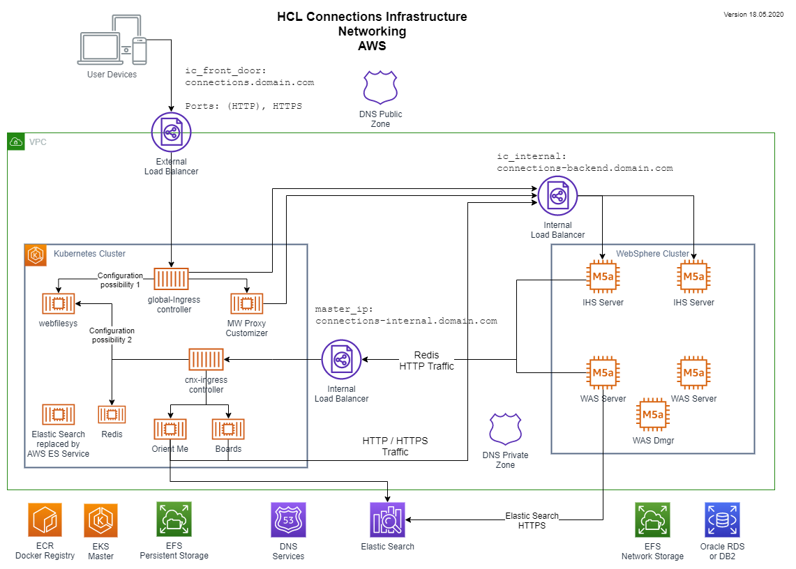

# 4 Configure your Network

When you want Customizer, you need to correct the network configuration at this early state. It is important as the installation of the Component Pack requires that all servers are reachable and that the correct host names are set up. Host names and access URLs could be changed later but this is not that simple and requires a lot of testing until everything is finally working as expected.

**Please be aware: You need to change the access URL for your existing Connections instance which will prevent your users to access the data until you have configured the Kubernetes infrastructure to forward the traffic correctly which is hopefully the case at the end of this chapter.**

This chapter will line out the tasks to get the new Kubernetes infrastructure to forward the traffic to the existing installation. The final Customizer configuration will be done later when everything is running.

This picture shows the target network setup. 



## 4.1 Change Service URL for your existing infrastructure

Your existing infrastructure must have a different DNS name than the frontend ingress controller so that traffic can flow from the users through the ingress controller into your existing infrastructure. To avoid that the existing WebSphere servers start to communicate through the ingress controller what will produce a lot of unnecessary load, the DNS Names and service configurations must be adjusted.

### 4.1.1 Create new DNS entry for your existing front end

Create a new DNS entry for your existing HTTP Server or front end load balancer. For simplicity you could append "-backend" to your existing DNS name. e.g. cnx.demo.com will become cnx-backend.demo.com. Create the same type of DNS entry as the existing one. When you have a A record, create a new A record with the same IP. If you have a CNAME, create a new CNAME record with the same value as the existing one.

### 4.1.2 Reconfigure your existing connections instance

**This reconfiguration requires a full restart of the instance**

The process is described by HCL on page [Configuring the NGINX proxy server for Customizer](https://help.hcltechsw.com/connections/v65/admin/install/cp_config_customizer_setup_nginx.html).

1. Get new SSL Certificates for your HTTP Server and in case for your Load Balancer where the Service Principal Name also includes the new DNS Name. The old name is only necessary until the new ingress controller is active. In case you do this during the same down time, the old name is not necessary in the SSL certificate.
2. Update your HTTP Server and in case your load balancer to use the new SSL certificate. 
3. Update all service names in the LotusConnections-config.xml from the existing DNS name to the new DNS name. 
4. Place the existing DNS Name in the Dynamic Host configuration so that URLs calculated by the system still have the old DNS name.
5. Restart your infrastructure

After the restart, your old infrastructure should behave normal. If not, you need to debug the configuration change and make sure the DNS entries point to the right systems.


# 4.2 Create configuration files

To simplify the resource creation, many settings can be placed into yaml files. Theses files will then be referenced by the various installation commands.  
Currently 3 different configuration files can be created automatically.  

1. global-ingress.yaml - Used by the creation of the global-ingress-controller
2. install_cp.yaml - Used by the creations of the component pack helm charts
3. boards-cp.yaml - Used by the creation of the activities plus helm chart

To create these files make sure, your `installsettings.sh` file is up to date, then run:

```
# Write Config Files
bash beas-cnx-cloud/common/scripts/write_cp_config.sh

```


# 4.3 Installing the Global Ingress Controller

The Customizer requires a reverse proxy in front of the whole infrastructure so that some specific HTTP URLs can be redirected to the Customizer for modification. HCL suggests to use a nginx server. As it is a common problem on kubernetes infrastructures to redirect HTTP(s) traffic to different backend services (internal servers and external endpoints) out of the box solutions exists that can be used.

This chapter uses the nginx-ingress controller from [nginx-ingress](https://kubernetes.github.io/ingress-nginx/).  
Microsoft is has a documentation for their Azure AKS system on page [Create an HTTPS ingress controller on Azure Kubernetes Service (AKS)](https://docs.microsoft.com/en-us/azure/aks/ingress-tls). This instructions work for AWS EKS as well when you adapt the Microsoft specific commands. 

There are different possibilities on how to connect to a Kubernetes cluster. Usually this is done via a load balancer. The load balancer can be set up automatically by Kubernetes or manually. The load balancer ip can be either internal or a public ip address.

The infrastructure will contain 2 ingress controller. The global we are currently set up and the cnx-ingress-controller provided by HCL. All HCL and Kudos components assume that the cnx-ingress-controller is the default ingress controller. Therefore the new global-ingress-controller uses a different ingress-class called `global-nginx`. 

To install the globa ingress controller make sure you created the global-ingress.yaml file, then run:

```
# Global Ingress Controller
helm upgrade global-nginx stable/nginx-ingress -i -f ./global-ingress.yaml --namespace connections 

```

The helm chart automatically creates the internal load balancer, forwarding http, https, 30099 (Redis) and 30379 (Elasticsearch).  

To allow your external users access this ingress controller via http / https, create an external facing loadbalancer by running:

```
# Create External LB
kctl apply -f beas-cnx-cloud/AWS/kubernetes/aws-external-lb.yaml

```


# 4.4 Make sure your DNS resolution and service configuration is right

The DNS resolution must be set correctly to allow users and services to access your ingress controller from everywhere. 
Especially when using the automatic SSL Certificate generation configured in 4.5.1 Automatic SSL Certificate retrieval and renewal.

The script detects the currently running services by name, get the configured load balances and then creates Route53 CNAME entries in the appropriate Zones.  

To configure the DNS entry for your LB via script run:

```
# Create CNAME entries for your Load Balancers
bash beas-cnx-cloud/AWS/scripts/setupDNS4Ingress.sh

```

# 4.5 Get SSL Certificate

To secure your traffic a SSL certificate is necessary. This certificate must be added to a kubernetes secret.

## 4.5.1 Automatic SSL Certificate retrieval and renewal
When using the ingress controller together with the [cert-manager](https://cert-manager.io/) , the necessary ssl certificates can be retrieved automatically. This setup is currently described here as it is documented by Microsoft on the page [Install cert-manager](https://docs.microsoft.com/en-us/azure/aks/ingress-tls#install-cert-manager).

** The SSL Certificate retrieval only works, when you are using a pulbic Load Balancer (The ingress controller is accessible via http (port 80) from the public internet and your productive DNS entry is already pointing to your load balancer. (see Topic 4.4) **

Setup the certificate manager is simple when your ingress controller has a public IP.  
I recommend trying out the configuration which is copied from Microsoft:

```
# Install the CustomResourceDefinition resources separately
kubectl apply -f https://raw.githubusercontent.com/jetstack/cert-manager/release-0.8/deploy/manifests/00-crds.yaml

# Create the namespace for cert-manager
kubectl create namespace cert-manager

# Label the cert-manager namespace to disable resource validation
kubectl label namespace cert-manager certmanager.k8s.io/disable-validation=true

# Add the Jetstack Helm repository
helm repo add jetstack https://charts.jetstack.io

# Update your local Helm chart repository cache
helm repo update

# Install the cert-manager Helm chart
helm install \
  --name cert-manager \
  --namespace cert-manager \
  --version v0.8.0 \
  jetstack/cert-manager
  
```

to create the CA cluster issuer configuration update your installsettings.sh:  
Required parameters:

```
# Let's Encrypt CA Issuer configuration
acme_email=<valid email from your organization>
use_lestencrypt_prod=[true, false]

```

and run:

```
bash beas-cnx-cloud/Azure/scripts/ca_cluster_issuer.sh

```

## 4.5.2 Manual SSL Certificate creation
If you want to use an other CA managed certificate or a self singed certificate create the secret manually.  
For simplicity we use a self singed certificate in this documentation. Example: [TLS certificate termination](https://github.com/kubernetes/contrib/tree/master/ingress/controllers/nginx/examples/tls)

```
# Create a self signed certificate
openssl req -x509 -nodes -days 365 -newkey rsa:2048 -keyout /tmp/tls.key -out /tmp/tls.crt

# Store the certificate inside Kubenetes
kubectl -n connections create secret tls tls-secret --key /tmp/tls.key --cert /tmp/tls.crt

```

# 4.6 Configure filebrowser to use this new ingress controller

To test the certificate creation or your assigned certificates, the ingress controller must be configured to forward traffic. 
The filebrowser created in chapter 3, can be used for this purpose. 

Make sure the filebrowser pod is up and running. If not review chapter 3 Install your first application.

```
kubectl get pods -n connections -l app.kubernetes.io/name=filebrowser

```

The ingress resource will proxy all traffic for /filebrowser from the public IP to the filebrowser service.

To create the resource run:

```
#Run script to create the fb-gloabal-ingress rule
bash beas-cnx-cloud/common/scripts/fb_global_ingress.sh

```

# 4.7 Test your forwarding

To test your forwarding, you can use curl or wget. I do not recommend to use a browser as the forwarding might not fully functional yet and with a full browser it is not that easy to see the details.

**Test the access to your ingress loadbalancer by IP**

Your DNS entry may still pointing to the "old" infrastructure. In this case the DNS name can not yet tested.

Access the Load Balancer DNS name e.g. curl -v -k "https://<lb ip>"

* When the forward works as expected, the result of the test should be a "302" redirect to the DNS Name of your old connections instance.
* When the access to the service does not work, you get a connection timeout
* When the access to the service works but the forward fails, you get a 502 Gateway not reachable error.

** Test the access to your ingress loadbalancer by DNS**

To access the load balancer via DNS Name, you need to either reconfigure your DNS Server or create a local hosts entry on your computer.

1. Test `ping <dns name>` to check the correct DNS resolution to your new load balancer.
2. Test `curl -v -k http://<dns name>` to check the correct response.<br>
The results of your test should be a redirect to the DNS name of your old infrastructure.<br>
The error causes are the same as above.

** Test with a browser **

You can now use a browser to test the access.

**[Install your first application << ](chapter3.html) [ >> Install Component Pack](chapter5.html)**