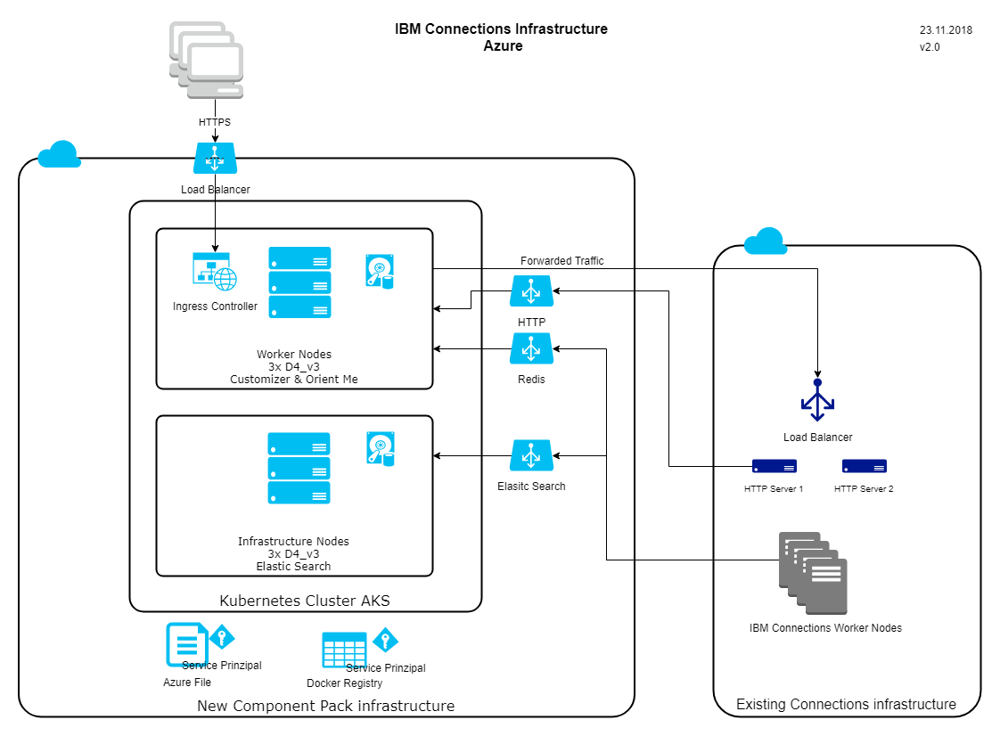

Create an HCL Component Pack installation on managed Kubernetes
==============================================================

HCL has updated the HCL Connections Component Pack to work on a native Kubernetes installation without IBM Cloud private. This gives everyone the chance to deploy the solution on a managed Kubernetes infrastructure.

HCL has documented the installation of HCL Connections Component Pack on a reference installation which will probably reside in a private data center.

As many companies are now using cloud services, using Kubernetes services out of the cloud should also be an option to host the HCL Connections Component Pack.

This documentation provides information and installation guidelines to get HCL Connections Component Pack running on a managed Kubernetes service on one of the main cloud providers.

Setup of Kubernetes Infrastrucure
---------------------------------

__Minikube__

Instructions based on HCL Connections Component Pack Version 6.5.0.1  
[Create an HCL Component Pack installation on minikube](minikube/index.md)  
The installation uses as less as possible hardware and can be used for prove of concept installations.

__Amazon Web Services AWS__  

Instructions based on HCL Connections Component Pack Version 6.5.0.1  
[Installation instructions for Amazon Web Services](AWS/index.md)  
The installation uses AWS Services where ever possible.
  
__Microsoft Azure__

Instructions are base on IBM Connections Component Pack Version 6.0.0.6  
[Installation instructions for Microsoft Azure](Azure/index.md)

Integration with WebSphere Infrastructure
-----------------------------------------

Independent of the Kubernetes infrastructure used, the integration between the classic WebSpehre infrastructure and the Kubernetes infrastructure is necessary. As the configuration needs to be executed on 2 separate systems it is not that easy to fully automate the tasks without external automation tool.

[This guide gives some guidance and some scripts to speed up the integration.](integration/index.md) 

Modifications for Customizer
----------------------------

Integrating Customizer into the infrastructure adds another level of complexity to the system. The ingress point for network traffic is shifted from the classic IBH HTTP Server or its load balancer to a Nginx reverse proxy cluster. 

[This guide gives some guidance on how to configure the network ingress for customizer.](customizer/index.md)

Additional Features
-------------------

The kubernetes infrastructure is an open platform and can host other tools and applications that can add value to your HCL Connections environment.

* Web Based file manager for customizer files
* Activities Plus and Kudos Borads

[See this page for more details.](addons/index.md)

Result and Network Overview
---------------------------

After following the __Amazon Web Services guide__ an infrastructure similar to this picture is running:

After following the __Microsoft Azure guide__ an infrastructure similar to this picture is running:

After following the __Minikube guide__ an infrastructure similar to this picture is running:

